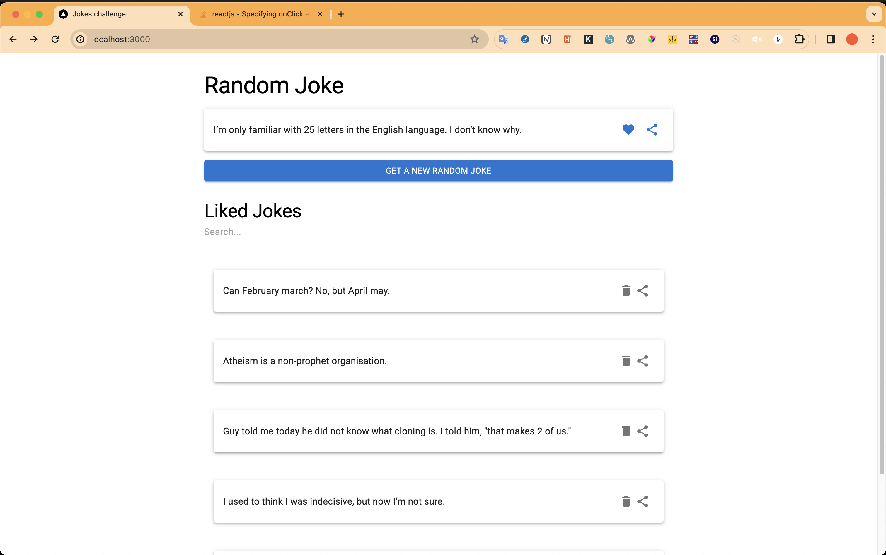
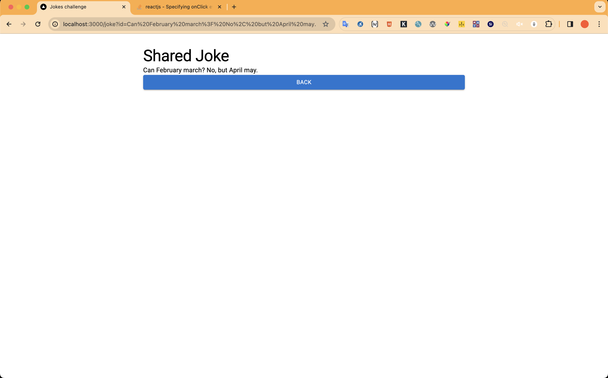
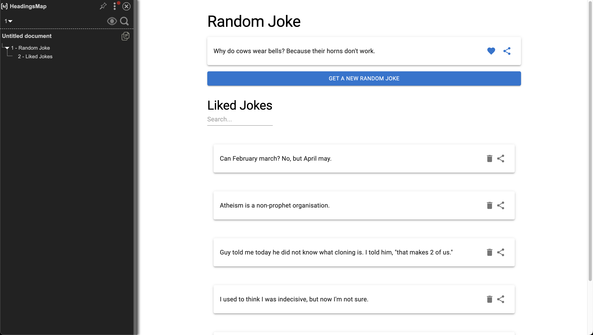
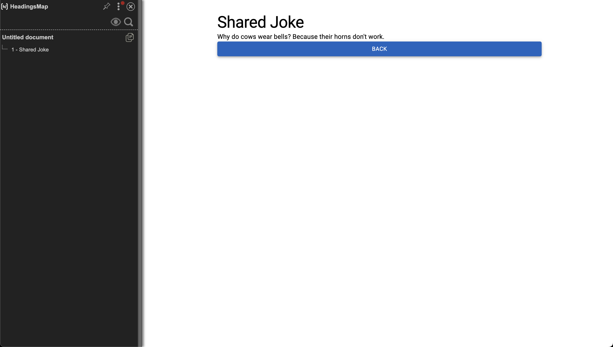
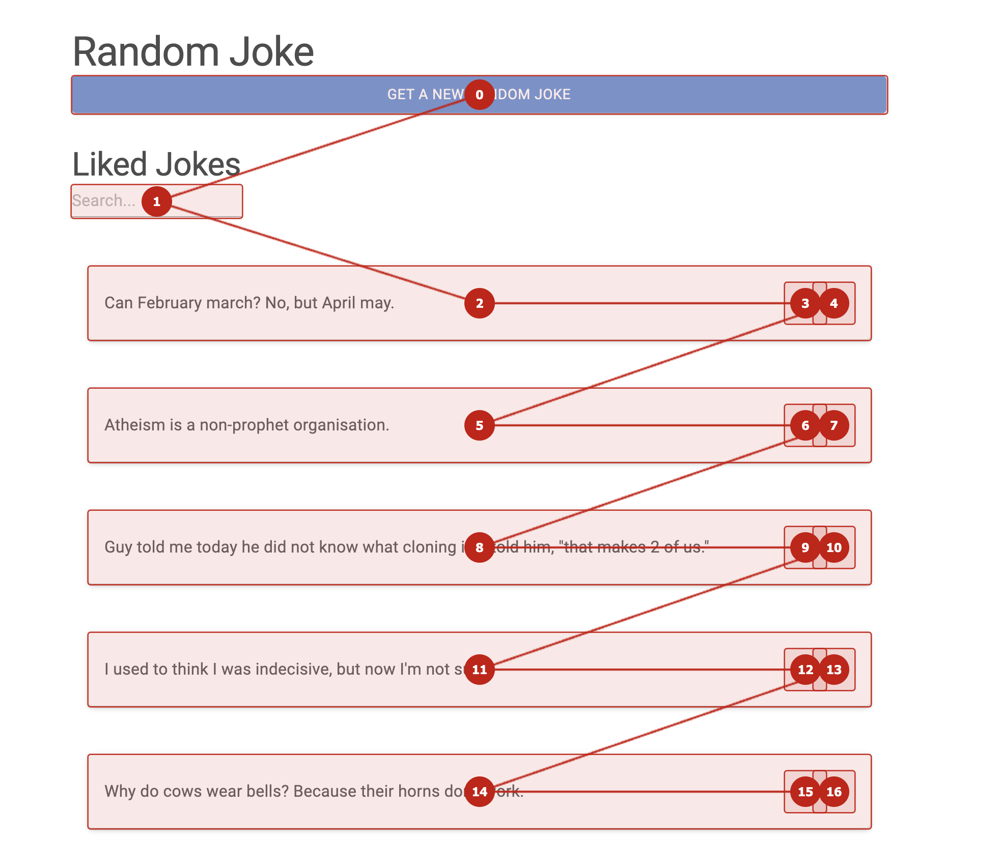
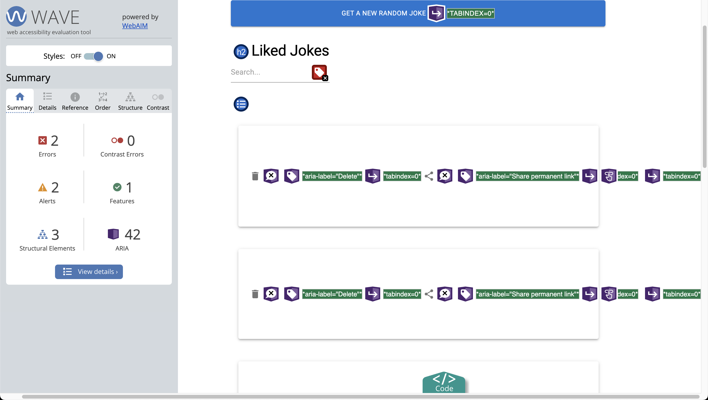
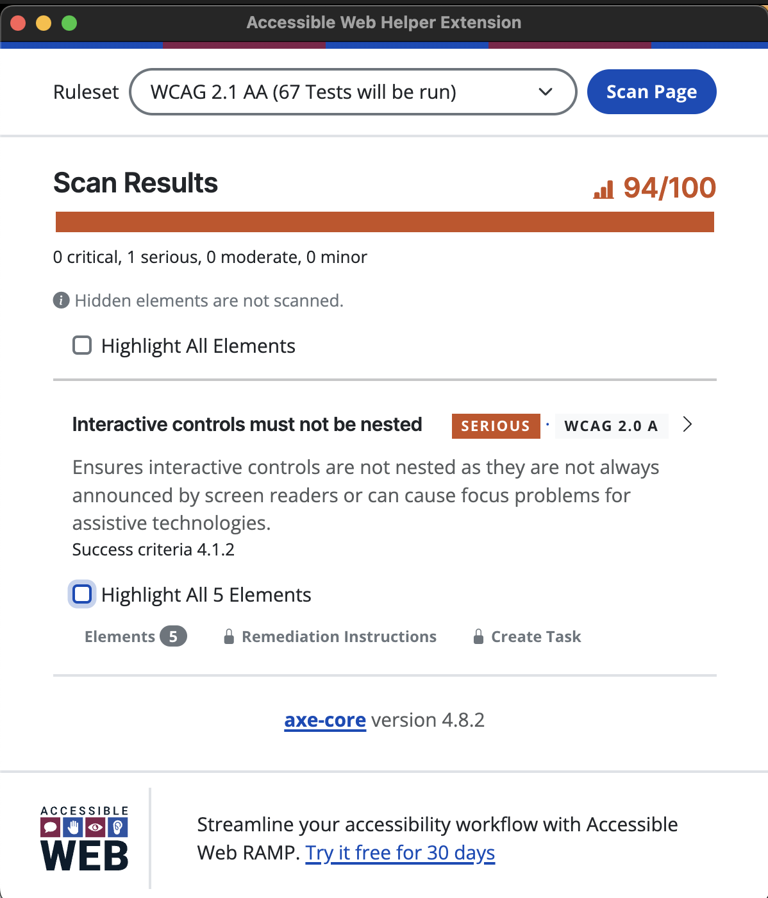
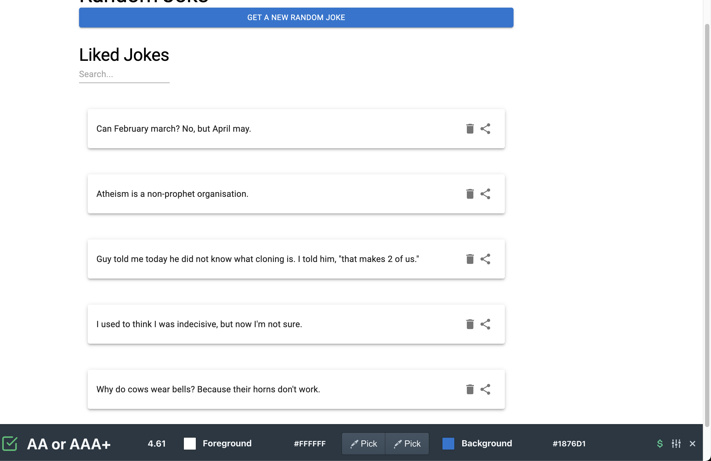
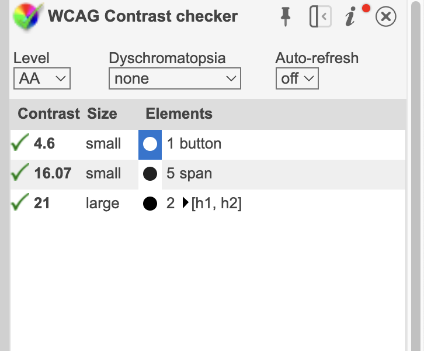

This is a [Next.js](https://nextjs.org/) project bootstrapped with [`create-next-app`](https://github.com/vercel/next.js/tree/canary/packages/create-next-app).

# Joke Sorting App

This is a simple Next.js app that allows users to view and manage a list of jokes. Users can get a random joke, like jokes, remove jokes, and manually sort their liked jokes.

## Features

- Get a random joke from the icanhazdadjoke API.
- Like jokes to add them to the liked jokes list.
- Remove jokes from the liked jokes list.
- Manually sort liked jokes using drag and drop functionality.
- Followed the WCAG 2.2 AAA guidelines/rules for Web Accessibility
- Use of the AAA principle for Unit Testing
- Follow of SOLID, YAGNI, KISS, and DRY principles

## Technologies Used

- Next.js
- TypeScript
- Tailwind CSS
- SWR (for data fetching)
- MUI (for UI components)
- SortableJS (for drag and drop functionality)
- LocalStorage (for storing liked jokes)
- Use MUI's NoSsr to avoid SSR for the list, which was causing hydration errors.

## How to Run

1.  Clone the repository.
2.  Install dependencies with `npm install`.
3.  Run the development server with `npm run dev`.
4.  Open http://localhost:3000 in your browser.

## How to Use

- Click the "Get Joke" button to fetch a random joke.
- Click the heart icon to like a joke and add it to your liked jokes list.
- Click the trash icon to remove a joke from your liked jokes list.
- Use the search bar to filter jokes by keyword.
- Drag and drop jokes in the liked jokes list to manually sort them.

## Assumptions

- The app uses the icanhazdadjoke API to fetch random jokes. Make sure you have an internet connection to fetch jokes.
- Liked jokes are stored in the browser's localStorage. If you clear your browser's localStorage, your liked jokes will be reset.
- Jokes are sorted based on the order in which they are dragged and dropped. The sorting is saved in localStorage.
- The app uses MUI icons for the heart (like) and trash (remove) actions.




## Web Accessibility

# Screen Reader

Demo Screen Reader Voice Over on MacOS: https://www.loom.com/share/dde074c6babb45948daa29264f3ea314

# Headings level




# Tab order



# Wave



# Accessibility web helper



# Color contrast primary button



# Color contrast checker



## Getting Started

First, run the development server:

```bash
npm run dev
# or
yarn dev
# or
pnpm dev
# or
bun dev
```

Open [http://localhost:3000](http://localhost:3000) with your browser to see the result.

You can start editing the page by modifying `pages/index.tsx`. The page auto-updates as you edit the file.

[API routes](https://nextjs.org/docs/api-routes/introduction) can be accessed on [http://localhost:3000/api/hello](http://localhost:3000/api/hello). This endpoint can be edited in `pages/api/hello.ts`.

The `pages/api` directory is mapped to `/api/*`. Files in this directory are treated as [API routes](https://nextjs.org/docs/api-routes/introduction) instead of React pages.

This project uses [`next/font`](https://nextjs.org/docs/basic-features/font-optimization) to automatically optimize and load Inter, a custom Google Font.

## Learn More

To learn more about Next.js, take a look at the following resources:

- [Next.js Documentation](https://nextjs.org/docs) - learn about Next.js features and API.
- [Learn Next.js](https://nextjs.org/learn) - an interactive Next.js tutorial.

You can check out [the Next.js GitHub repository](https://github.com/vercel/next.js/) - your feedback and contributions are welcome!

## Deploy on Vercel

The easiest way to deploy your Next.js app is to use the [Vercel Platform](https://vercel.com/new?utm_medium=default-template&filter=next.js&utm_source=create-next-app&utm_campaign=create-next-app-readme) from the creators of Next.js.

Check out our [Next.js deployment documentation](https://nextjs.org/docs/deployment) for more details.
